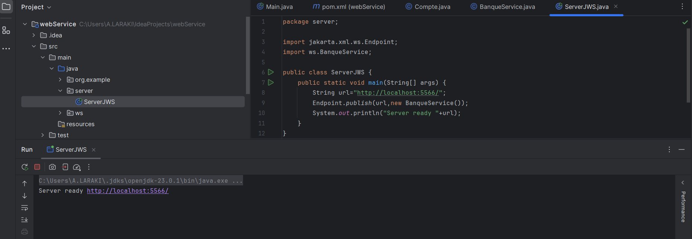
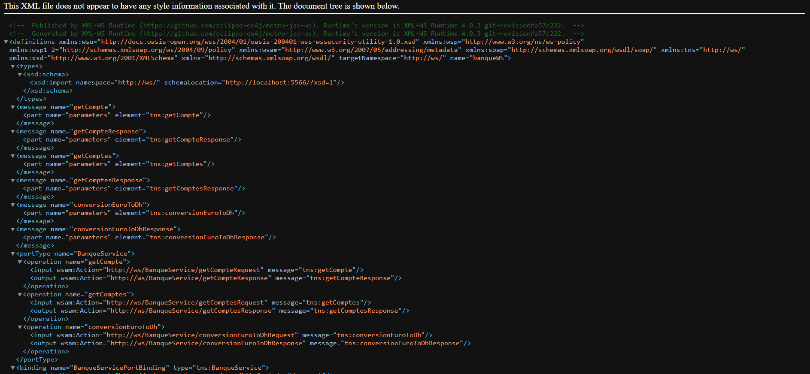
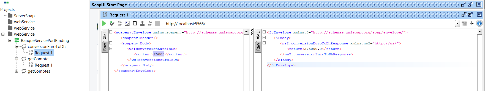
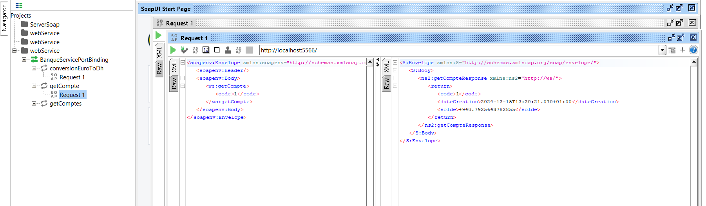
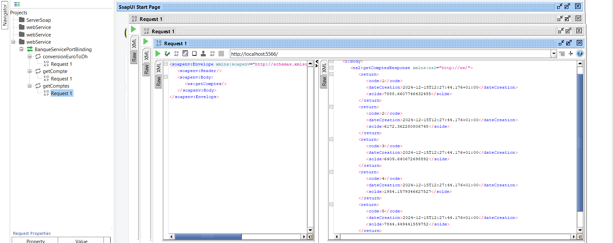
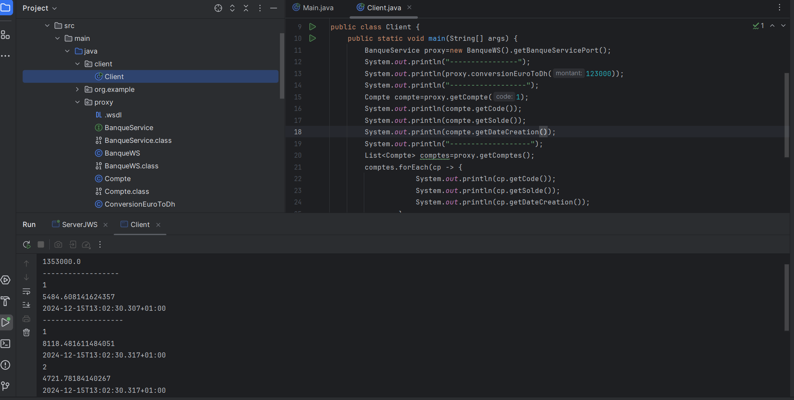

<h1>Web services SOAP WSDL</h1>

<h2>Déployer le Web service avec  Serveur JaxWS</h2>

<h2>Consulter et analyser le WSDL avec un Browser HTTP</h2>

<h2>Tester les opérations du web service avec SOAPUI </h2>

<h2>Client SOAP Java</h2>

